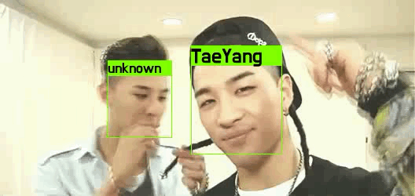
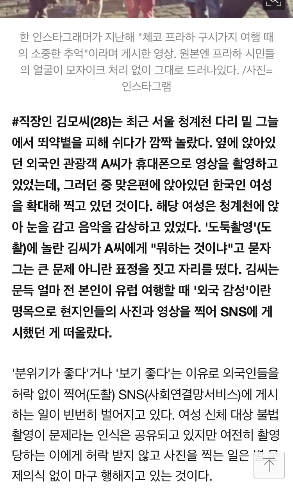

# 나만 바라봐 
## Only Look At Me

### Mosaic unregisterd personal face for privacy

    
     
    
     
    Press F5 button for sync gif files

## Why need this project

    
    
     
    나도 모르게 찍게 되는 타인의 초상권, 프라이버시를 보호합시다.

## Requirements
- python 3
- Pillow
- face_recognition
- pickle
- opencv-contrib-python 3.4.0.14
- dlib

## Usage  

First, install libs

    pip install opencv-contrib-python==3.4.0.14
    pip install dlib
    pip install face_recognition
    pip install pickle
    pip install pillow

**Just run!**  

    python main.py
